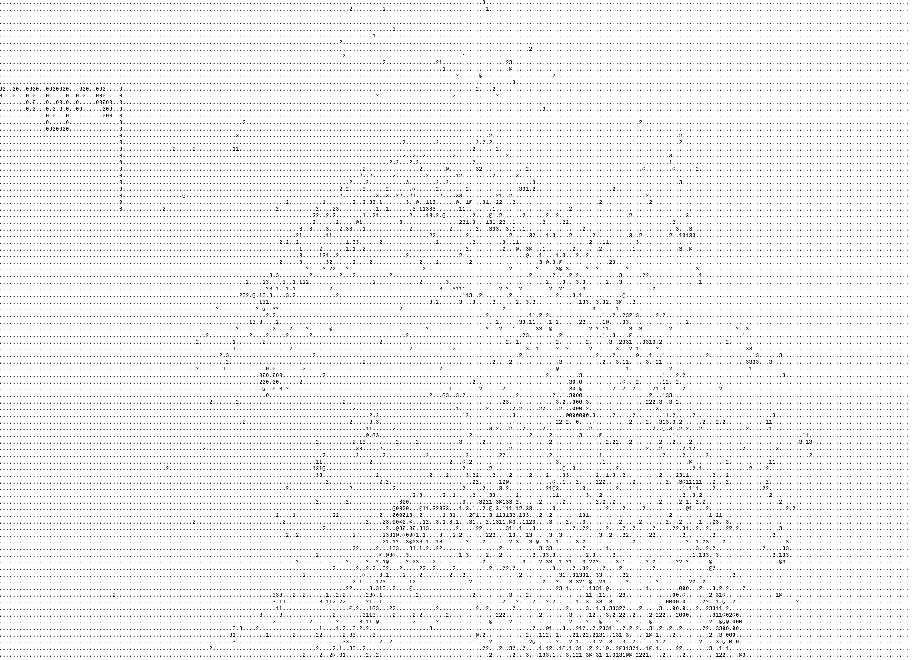
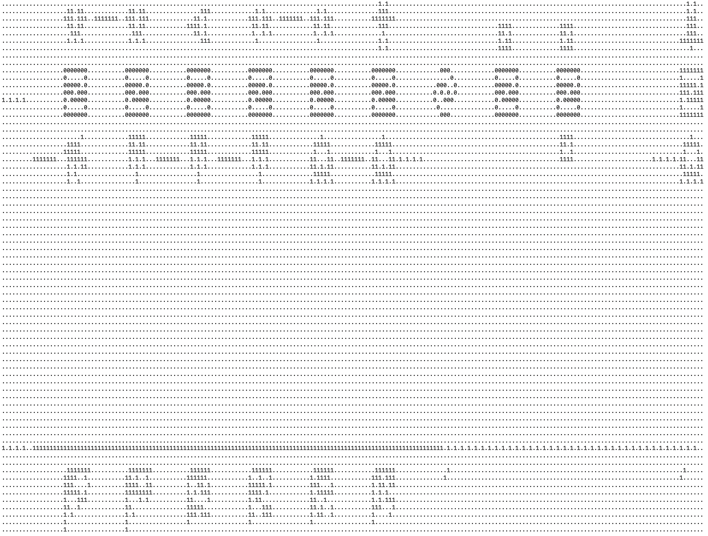

# boku_yaba

Note to the team members: the original README (in Japanese) has been moved
to [README.ja.md](./README.ja.md).

## Members

TODO

## Screenshots

## Steps

### Changing the client code

Create an arbitrary branch.
Send a PR and merge it after CI passes.

### Changing the server side

Create a branch beggining with `server`.
Send a PR and merge it after CI passes.

## CI

### cloudbuild_client_test.yaml

Kicked on each new PR.
Tests the client code with a pre-deployed dummy server.

### cloudbuild_server_test.yaml

Kicked on each new PR for server branches.
Tests the server code using client, without deployment.

### cloudbuild_master.yaml

Kicked when PR gets merged into master or submission branches.
Pushes the client and server docker images and deploys the server.

## Comments

This year's contest was tough: too many things to do; scattered information;
unclear subgoals (e.g. "How can we start a game?"). We had three members new
to ICFP Contest, so it was even tougher.

Still, we had lots of fun, so thank you the organizer team.
